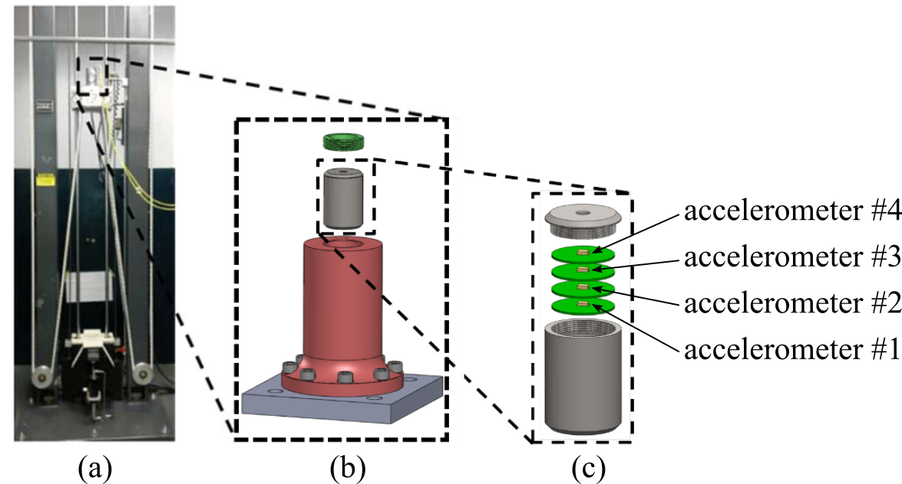
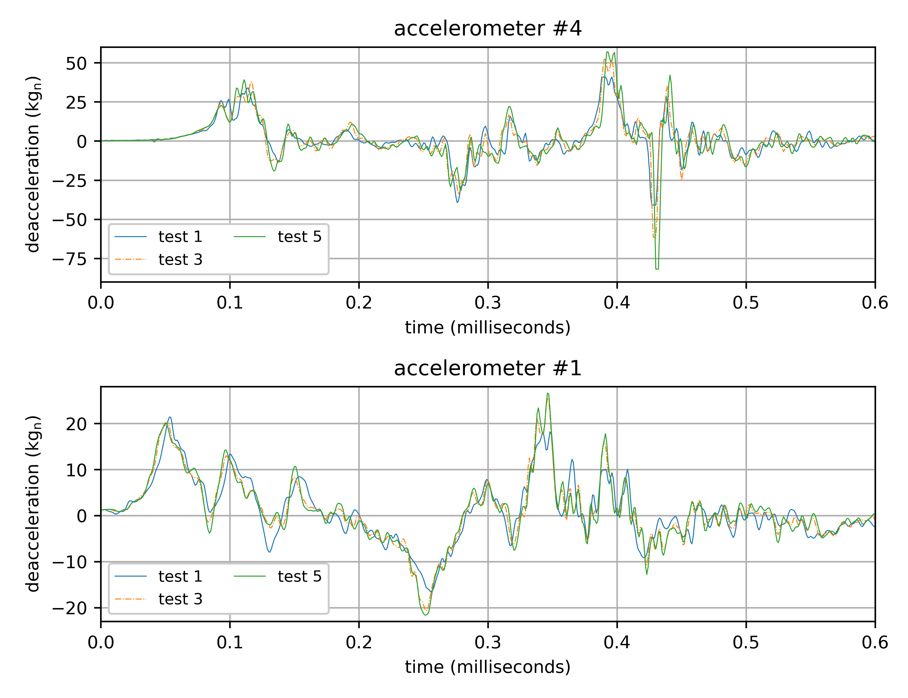
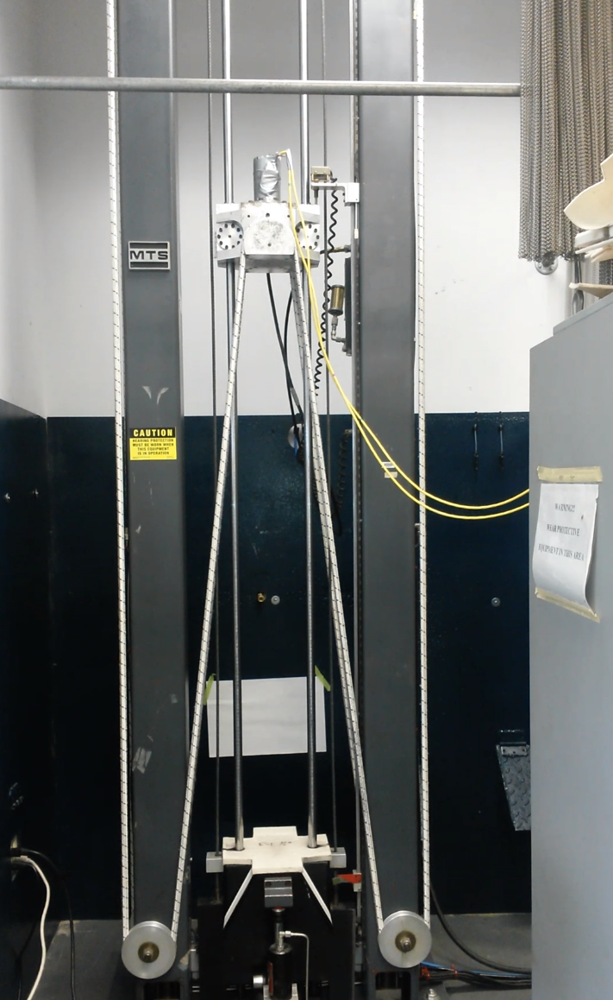

# Dataset-1-Quad-PCB-Shock-Loading

This dataset contains the measured acceleration data for an electronics unit under shock test. Figure 1 shows the electronics unit which consists of four circuit boards with high-g Meggitt 72 accelerometers mounted on each. The units for the accelerometers are in kgn and are sampled at 1 MS/s. The Meggitt 72 high-g accelerometers are able to accurately measure accelerations of 120,000 gn or 120 kgn, where 1 gn = 9.81 m/s2 = 32.2 ft/s2. The electronics are potted in the canister with potting material to secure all parts in place. 

Figure 1: Experimental setup for the quad PCB shock loading data showing the: (a) shock test system;  (b) mounting fixture, and; (c) electronics package.

The test specimen is subjected to 5 repeated tests where slight variations in the signal are observed, presumably caused by damage in the PCBs. Figure 2 shows the deceleration profile from three different tests for a single accelerometer.

Figure 2: Deacceleration data for test 1, 3, and 5 for accelerometer #1 (top) and accelerometer #4 (bottom). 

Figure 3 is presents the experimental test configuration where the package is mounted on a MTS-66 shock test system designed to generate various impact conditions and a video of the test can be found <a href="https://www.youtube.com/watch?v=Azxv1YyBkQw&ab_channel=ARTS-LabattheUniversityofSouthCarolina">here</a>.

  

Figure 3: Video of shock test (click the image to view the video on YouTube). 

This data set has subsequently been used in the following publications:
1. Hong, Jonathan, Simon Laflamme, Jacob Dodson, and Bryan Joyce. "Introduction to state estimation of high-rate system dynamics." Sensors 18, no. 1 (2018): 217.
1. Hong, Jonathan, Simon Laflamme, Liang Cao, Jacob Dodson, and Bryan Joyce. "Variable input observer for nonstationary high-rate dynamic systems." Neural computing and applications 32, no. 9 (2020): 5015-5026.
1. Hong, Jonathan, Simon Laflamme, and Jacob Dodson. "Study of input space for state estimation of high-rate dynamics." Structural Control and Health Monitoring 25, no. 6 (2018): e2159.

